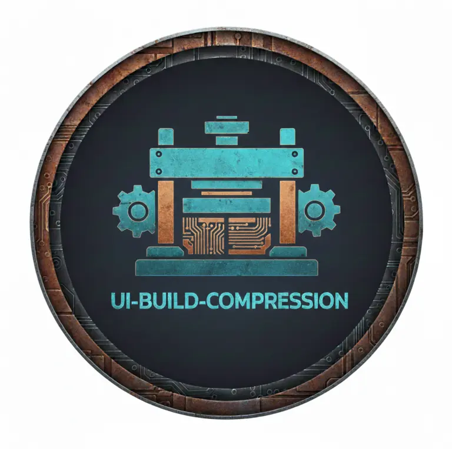

## UI Build Compressor

Static file compression for UI builds powered by rust.

Creates gzip, brotli, zstd, and deflate compressed file variants along side original files for you to deploy to production.

Each algorithm is configured for the most aggressive compression settings available

1. [Installation](#installation)
2. [Rust API](#rust-api)
3. [JavaScript API](#javascript-api)
4. [Command Line](#command-line)

## Installation

#### JavaScript/TypeScript

```bash
npm i -D @ui-perf/build-compression
yarn add -D @ui-perf/build-compression
pnpm add -D @ui-perf/build-compression
```

#### Rust

```bash
cargo add ui-build-compression
# or
cargo install ui-build-compression
```

### Rust API

```rust
// cargo add ui-build-compression

use ui_build_compression::compress;

compress("/path/to/my/directory");
```

### JavaScript API

```typescript
import { compress } from "@ui-perf/build-compression";

compress("/path/to/my/directory");
```

#### Command Line

```bash
# cargo install ui-build-compression
ui-build-compression /path/to/my/directory
```
